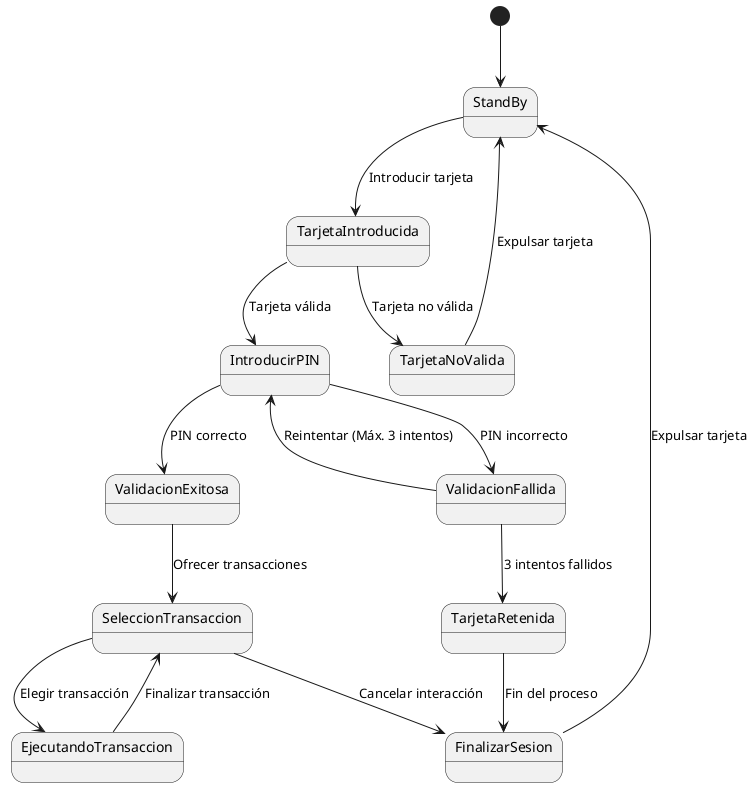

# Diagrama-Cajeros

## Código

## Explicación del código
Este diagrama nos muestra el estado de funcionalidad de un cajero que pasa del estado 'StandBy' hasta que se finaliza la transacción realizada. Los estados representan la situación del
cajero y las flechas indican las transiciones entre los estados.

### StandBy
El estado de 'StandBy' es el momento inicial del cajero que espera a que el usuario introduzca una tarjeta.

### Tarjeta Introducida
El estado 'Tarjeta Introducida' mostrará que el usuario ya ha introducido su tarjeta y pasará a la comprobación de si la tarjeta es válida o no.

### Tarjeta No Válida
Si al introducir la tarjeta, esta no es válida. El cajero volverá de nuevo al estado de 'StandBy'.

### Introducir Pin
Si al introducir la tarjeta, esta es válida. El cajero te pedirá que introduzcas el pin de la tarjeta.

### Validación Fallida
Si el pin es incorrecto, el cajero te permitirá intentarlo tres veces. Si fallas las tres veces, la tarjeta quedará retenida y se finalizará el proceso.

### Tarjeta Retenida
En este estado la tarjeta ha quedado retenida y bloqueada.

### Validación Exitosa
Si el pin es correcto, el usuario podrá comenzar a realizar sus operaciones.

### Selección Transacción
Aquí el usuario podrá realizar operaciones como: retirar, consultar o transferir su dinero.

### Ejecutando Transaccion
Es el proceso en el que el cajero realiza la operación elegida por el usuario.

### Finalizar Sesión
Cuando se completa la transacción o el usuario cancela la operación, el sistema devuelve la tarjeta y vuelve al estado de 'StandBy' hasta que se introduzca otra tarjeta.
